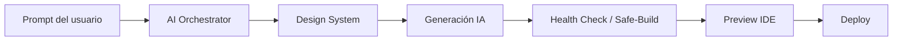

# GafCore — Guía de arquitectura y flujo de producción

**GafCore** es la plataforma para crear y operar sitios y apps con IA. Stack: TanStack Start · Vite · Supabase · Vercel.

## Flujo principal (de punta a punta)



| Etapa | Qué hace | Dónde vive |
|-------|----------|------------|
| **1. Prompt del usuario** | Instrucción en el chat IDE o marketplace | `ChatPanel.tsx` |
| **2. AI Orchestrator** | Elige modelo (fast / deep / UI) y tarea (`code`, `design`, `fix`…) | `src/services/ai/aiOrchestrator.server.ts`, `chat-brain.server.ts` |
| **3. Design System** | Inyecta `BASE_DESIGN_SYSTEM` + blueprints (p. ej. SaaS, Movilidad) | `src/services/ai/systemPrompts.ts`, `design-engine.shared.ts` |
| **4. Generación IA** | Chat completions → JSON `{ reply, files }` | `gafcore-chat-api.server.ts` |
| **5. Health Check** | Validación local + `diagnoseAndRepair` + reparación Safe-Build | `safe-build.server.ts`, `gafcoreSystemic.server.ts` |
| **6. Deploy** | GitHub / Vercel del proyecto del usuario | `github-publish.server.ts`, panel Publicar |

## Pruebas de fuego (QA)

### Sistema inmunológico

1. Abre **`/gafcore/debug/health`** (componente `DebugHealth.tsx`).
2. Pulsa **Import inexistente** o **Error de lógica**.
3. En la consola del navegador (F12) busca el grupo **`[GafCore Inmunológico]`** con `rootCause`, `errorType`, `success`.

### Plantilla Movilidad

1. Abre **`/gafcore/templates/mobility`**.
2. Activa **Simular fallo de mapa** para ver `HealthStatus` → «Recalibrando la ruta».
3. Código fuente: `src/templates/mobility/GextMain.tsx`.

## Carpetas clave

```
src/services/ai/     # Orquestador, Safe-Build, prompts, blueprints
src/services/health/ # diagnoseAndRepair, logs, interceptor API
src/templates/       # Plantillas maestras (mobility, …)
src/lib/             # Chat, gateway IA, caché Supabase
docs/                # Arquitectura de lanzamiento (escala)
```

## Variables de entorno

Ver `.env.example`. Mínimo para IA: `OPENROUTER_API_KEY` o `OPENAI_API_KEY` + Supabase (`VITE_SUPABASE_*`, `SUPABASE_SERVICE_ROLE_KEY`).

## Comandos útiles

```bash
bun install
bun run dev
npm run build
npm run gafcore:doctor
```

## Escalar GafCore

Documento detallado: [docs/GAFCORE_LAUNCH_ARCHITECTURE.md](docs/GAFCORE_LAUNCH_ARCHITECTURE.md).

---

Marca: **gafcore.com** · Solo GafCore en UI (errores sanitizados, sin nombres de proveedores externos).
