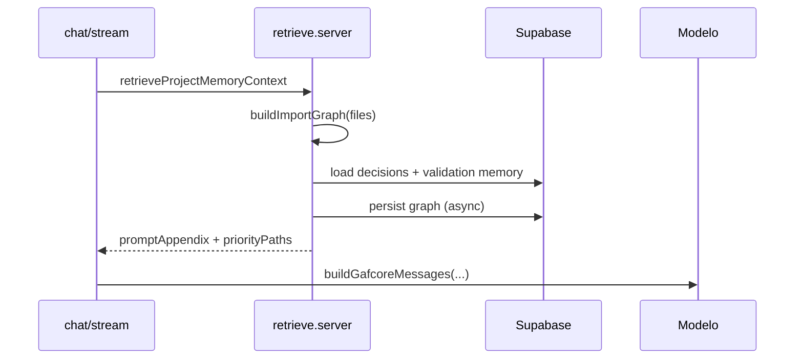

# GafCore — Memory System + Knowledge Graph

> **Estado:** M0/M1 implementado en código. Aplicar migración `20260527120000_project_memory_graph.sql` en Supabase.

## Objetivo

Memoria persistente por proyecto para que la IA **recuerde**, **entienda estructura** y **no rompa contexto** al editar.

## Capas

| Capa | Implementación actual |
|------|------------------------|
| L0 Working | Archivos del IDE en el body del chat |
| L1 Episódica | `chat_messages`, `gafcore_pipeline_runs` (existente) |
| L2 Semántica | **Pendiente** (Etapa 9 — pgvector) |
| L3 Estructural | `project_graph_nodes` / `project_graph_edges` + `buildImportGraph()` |
| L4 Procedural | `project_decisions` + `project_ai_memory` (validación) |

## Módulos

```
src/memory/
  types.ts                 — MemoryRetrieveInput, ProjectMemoryContext, ImportGraph
  import-graph.shared.ts   — grafo de imports (heurística)
  format-prompt.shared.ts  — bloques de prompt
  graph-persist.server.ts  — persistencia Supabase (service role)
  retrieve.server.ts       — retrieveProjectMemoryContext() ← punto de entrada
```

## Contrato principal

```typescript
const ctx = await retrieveProjectMemoryContext({
  projectId,       // opcional
  userId,
  instruction,
  files,           // snapshot actual del proyecto
});

// ctx.promptAppendix → anexar al system prompt
// ctx.priorityPaths  → priorizar en selectContextFiles()
```

Integrado en:

- `gafcore-chat-api.server.ts` (stream + complete)
- `gafcore-chat.functions.ts` (server fn fallback)

## Tablas (migración)

- `project_decisions` — decisiones, convenciones, branding
- `project_graph_nodes` — archivos indexados (`path`, `content_hash`)
- `project_graph_edges` — `imports`, `depends_on` (npm)

RLS: lectura usuario autenticado; escritura **service role** (servidor).

## Server functions

- `recordProjectDecision` — guardar decisión manual o desde UI
- `previewProjectMemoryPack` — debug del pack generado

## Flujo



## Roadmap siguiente

| Fase | Entregable |
|------|------------|
| M2 | `project_memory_chunks` + pgvector + hybrid retrieval |
| M3 | Snapshots por `pipeline_run_id`, resúmenes de chat |
| M4 | Agentes Planner/Coder con Memory Pack en orchestrator |
| M5 | Impact analysis + sync GitHub commit |

Ver `ROADMAP.md` Etapa 9.

## Operación

1. Aplicar migración SQL en Supabase.
2. Desplegar app (chat API con memory wired).
3. Opcional: `recordProjectDecision` desde soporte/admin para fijar convenciones.

Logs: `gafcore_memory_retrieve` en servidor (meta.ms, graphNodes, etc.).
