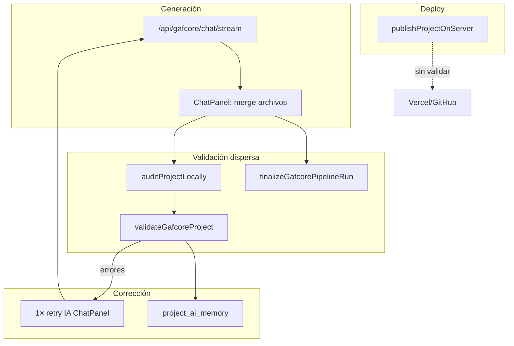
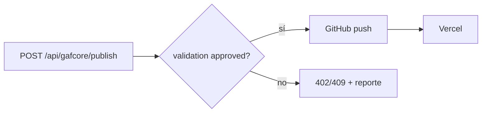
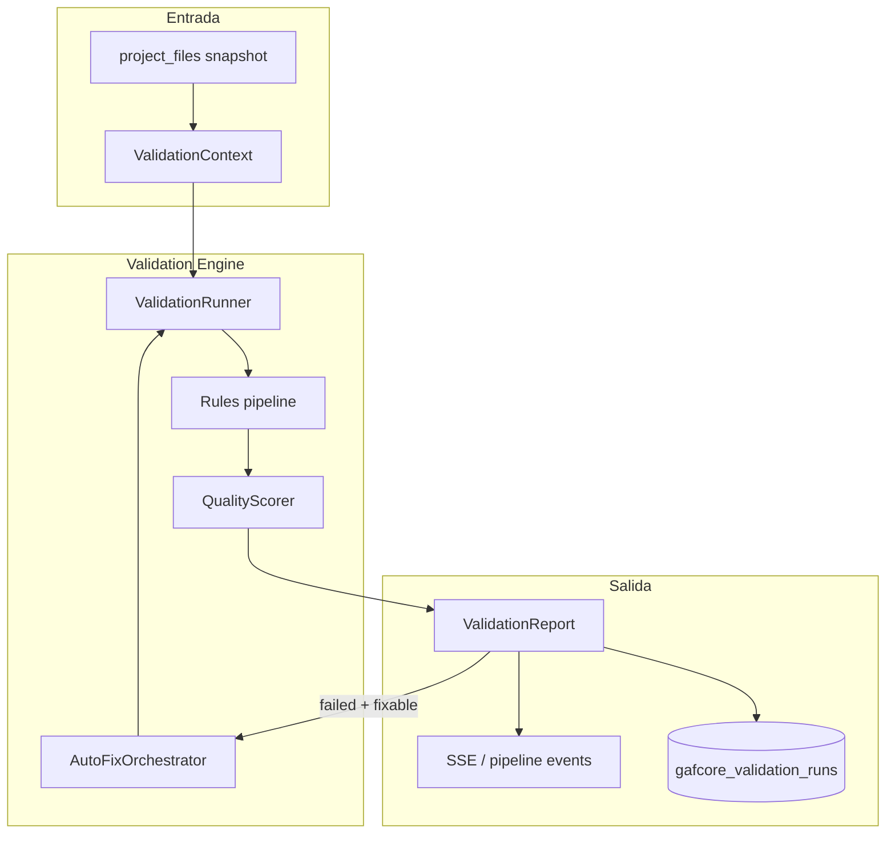
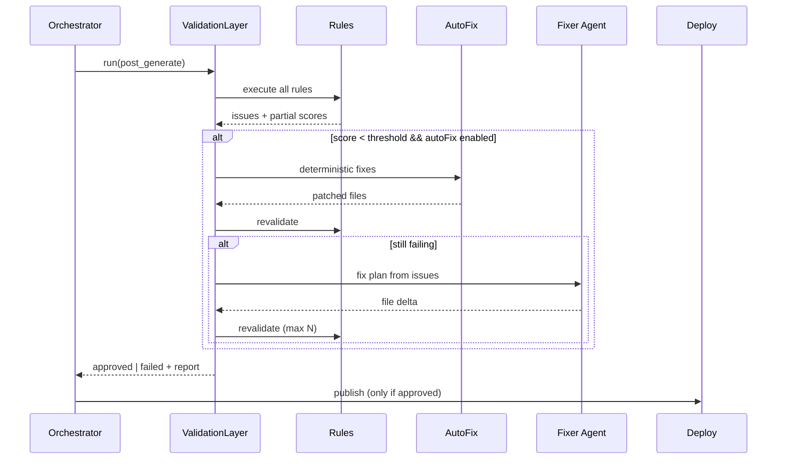
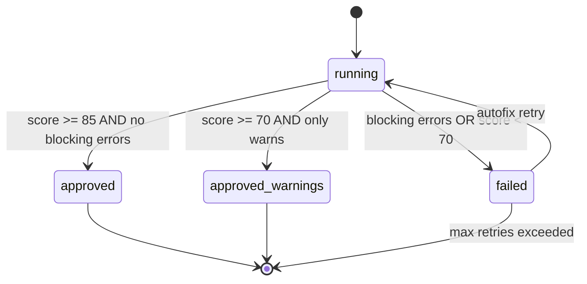

# GafCore — AI Validation Layer

> **Estado:** planificación (no implementado). Complementa `ORCHESTRATOR.md` y `ROADMAP.md`.

## 1. Resumen ejecutivo

GafCore **ya tiene un MVP de validación** (heurísticas + transpile TS + functional-first + 1 reintento IA en `ChatPanel`). Falta una **capa profesional unificada** que:

- centralice reglas y resultados,
- puntúe calidad,
- aplique auto-fix determinista + IA,
- **bloquee deploy** si no aprueba,
- registre auditoría por `pipeline_run`.

**Objetivo:** convertir la validación en un **producto** del pipeline, no lógica dispersa en la UI.

---

## 2. Estado actual (análisis técnico)

### 2.1 Módulos existentes

| Módulo | Ubicación | Qué valida hoy |
|--------|-----------|----------------|
| Validación IA (cliente) | `gafcore-ai-validation.shared.ts` | imports relativos, `package.json`, `index.html`, `main.tsx`, `App` default, balance `{}`/`()`, functional-first |
| Validación servidor | `gafcore-validate.server.ts` | + transpile TS/TSX (`typescript.transpileModule`) |
| Server fns | `gafcore-validate.functions.ts` | `validateGafcoreSources`, `validateGafcoreFunctional`, `validateGafcoreProject` |
| Orchestrator | `gafcore-orchestrator-pipeline.server.ts` | `finalizeGafcorePipelineRun` → `validateGafcoreProjectData` + memoria |
| UI | `ChatPanel.tsx` | audit local + remoto, 1 retry con `buildValidationFixInstruction` |
| Plantillas | `gafcore-templates.shared.ts` | `validateTemplateFiles` (estructura mínima) |
| Admin diagnósticos | `gafcore-diagnostics-*.server.ts` | escaneo plataforma, fixes en sandbox ( **no** integrado al flujo IDE) |
| Deploy | `github-publish.server.ts` | **sin gate de validación** |

### 2.2 Categorías de issue actuales

```typescript
// gafcore-ai-validation.shared.ts
type ValidationCategory = "syntax" | "import" | "build" | "functional";
type ValidationSeverity = "error" | "warn";
```

### 2.3 Flujo real hoy



**Problemas detectados:**

1. **Doble camino:** cliente y orchestrator validan por separado.
2. **Sin build real:** no ejecuta `vite build` ni `npm install`.
3. **Sin ESLint / rutas / env / seguridad** sistemáticos.
4. **Auto-fix = solo IA** (costoso, inconsistente); diagnósticos admin no reutilizados.
5. **Deploy desacoplado:** publicar no exige `validation_status = approved`.
6. **Sin scoring** ni trazabilidad unificada (solo issues en UI).

---

## 3. Integraciones

### 3.1 Orchestrator

| Hoy | Objetivo |
|-----|----------|
| Paso `validate` en `finalizeGafcorePipelineRun` | Paso `ValidationLayer.run()` con reporte completo |
| `retrying` por `orchestratorShouldRetry` | Retry policy por categoría (syntax vs functional vs build) |
| `events_json` en `gafcore_pipeline_runs` | + `validation_report_id` |

**Contrato propuesto:**

```typescript
type ValidationRunInput = {
  pipelineRunId: string;
  projectId: string;
  userId: string;
  files: FileSnapshot[];
  phase: "post_generate" | "pre_deploy" | "manual";
};
```

### 3.2 Template Engine

| Momento | Validación |
|---------|------------|
| Post-seed (`createProjectFromTemplate`) | `template_contract` — archivos obligatorios por slug |
| Pre-primer-generación | baseline score ≥ umbral (ej. 85) |

Reglas por plantilla en `gafcore_project_templates.metadata_json`:

```json
{
  "requiredFiles": ["index.html", "main.tsx", "App.tsx"],
  "requiredDeps": ["react", "react-dom"],
  "scaffold": "vite-react"
}
```

### 3.3 Deploy Engine

**Gate obligatorio (fase V5):**



- Leer último `gafcore_validation_runs` con `status = approved` y `project_id`.
- TTL: válido si `created_at` > último cambio en `project_files`.

### 3.4 Agentes IA (futuro)

| Agente | Rol |
|--------|-----|
| **Codegen** | genera delta |
| **Validator** | ejecuta reglas, no genera UI |
| **Fixer** | aplica parches mínimos según `FixPlan` |
| **Reviewer** | aprueba score ≥ umbral |

Comunicación **solo por artefactos** (`ValidationReport`, `FixPlan`, `FilePatch[]`), no chat libre entre agentes.

---

## 4. Arquitectura objetivo

### 4.1 Estructura modular (propuesta)

```
src/validation/
  types.ts                 # ValidationReport, RuleResult, ScoreCard
  runner.ts                # orquesta reglas en orden
  context.ts               # proyecto, files, env, template slug
  rules/
    syntax.rule.ts
    imports.rule.ts
    dependencies.rule.ts
    structure.rule.ts
    functional.rule.ts
    routes.rule.ts         # TanStack file routes (si aplica)
    env.rule.ts
    deploy.rule.ts
    security.rule.ts       # secretos hardcoded, eval, etc.
  scorers/
    quality-score.ts       # agrega dimensiones
  autofix/
    registry.ts
    import-path.fix.ts
    package-json.fix.ts
    jsx-syntax.fix.ts      # reutilizar repairGafcoreProjectMedia / jsx repair
    ai-fix.agent.ts        # wrapper buildValidationFixInstruction + gateway
  reporters/
    console.reporter.ts
    supabase.reporter.ts   # persiste runs
    sse.reporter.ts        # eventos al IDE
  integrations/
    orchestrator.ts
    deploy-gate.ts
    templates.ts

src/lib/gafcore-validate.server.ts   # migrar a rules/ (compat)
```

### 4.2 Diagrama lógico



---

## 5. Flujo de validación profesional



### Fases del pipeline completo

```
Template seed → contract check
     ↓
Generación IA
     ↓
Validation Layer (post_generate)
     ↓
Auto-fix determinista
     ↓
Revalidación
     ↓
Auto-fix IA (opcional, presupuesto créditos)
     ↓
Revalidación
     ↓
Testing ligero (smoke / preview compile)
     ↓
Aprobación (score ≥ umbral, 0 errores bloqueantes)
     ↓
Deploy gate → GitHub → Vercel
     ↓
Validación post-deploy (opcional: URL alive, status)
```

---

## 6. Sistema de reglas

### 6.1 Diseño

Cada regla implementa:

```typescript
interface ValidationRule {
  id: string;
  category: ValidationCategory;
  severity: "error" | "warn" | "info";
  run(ctx: ValidationContext): Promise<RuleResult>;
  fixable?: boolean;
  autofix?: (ctx, issues) => Promise<FixResult | null>;
}
```

**Orden recomendado (barato → caro):**

1. `structure` — archivos requeridos, paths
2. `syntax` — braces + transpile TS
3. `imports` — resolución relativa
4. `dependencies` — package.json vs imports
5. `functional` — handlers, forms, botones
6. `routes` — coherencia TanStack (proyectos avanzados)
7. `env` — variables referenciadas vs secrets proyecto
8. `security` — patrones peligrosos
9. `build` — `vite build` en sandbox (fase tardía)
10. `deploy` — repo configurado, vercel meta

### 6.2 Matriz cobertura (objetivo vs hoy)

| Validación | Hoy | Fase |
|------------|-----|------|
| imports | heurística | V1 ✓ mejorar |
| dependencias | parcial | V2 |
| estructura archivos | parcial | V1 |
| TypeScript | transpile | V1 ✓ |
| ESLint | no | V4 |
| build real | no | V5 (worker/sandbox) |
| rutas | no | V4 |
| APIs | no | V5 |
| ENV | no | V3 |
| versiones | no | V3 |
| deploy config | no | V3 gate |
| DB config | no | V6 |
| runtime | preview errors only | V3 |
| performance | no | V6 |
| seguridad | no | V3 básico |

---

## 7. Auto-fix system

### 7.1 Dos capas

| Capa | Método | Coste | Ejemplos |
|------|--------|-------|----------|
| **Determinista** | reglas `autofix` | 0 créditos | path import, añadir `react` a package.json, repair JSX glue |
| **IA** | Fixer agent | créditos | conflictos lógicos, layout, refactors |

### 7.2 Política de reintentos

```typescript
const RETRY_POLICY = {
  maxDeterministicPasses: 2,
  maxAiPasses: 2,        // por pipeline run
  maxTotalWallMs: 120_000,
  retryOn: ["syntax", "import", "build"],
  noRetryOn: ["security_critical"],
};
```

Reutilizar `buildValidationFixInstruction` + gateway; mover lógica fuera de `ChatPanel`.

### 7.3 Revalidación

Siempre `ValidationRunner.run()` completo tras cada fix; no confiar solo en regla parcial.

---

## 8. Scoring / calidad

### 8.1 Dimensiones (0–100 cada una)

| Dimensión | Peso | Señales |
|-----------|------|---------|
| **estabilidad** | 25% | errores syntax/import/build |
| **compatibilidad** | 15% | deps, versiones, Vite config |
| **performance** | 10% | bundle heurístico, imágenes sin dimensiones |
| **estructura** | 15% | carpetas, exports, template contract |
| **seguridad** | 15% | secretos, `dangerouslySetInnerHTML`, eval |
| **mantenibilidad** | 10% | archivos gigantes, duplicación |
| **funcionalidad** | 10% | functional-first audit |

### 8.2 Score global

```
overall = Σ (dimensión × peso) − penalización_errores_bloqueantes
```

| Rango | Estado | Deploy |
|-------|--------|--------|
| ≥ 85 y 0 errors | `approved` | permitido |
| 70–84 | `approved_with_warnings` | permitido + aviso UI |
| < 70 o errors | `failed` | bloqueado |

### 8.3 Ejemplo reporte

```json
{
  "status": "failed",
  "overallScore": 62,
  "dimensions": {
    "stability": 40,
    "compatibility": 80,
    "functionality": 70
  },
  "issues": [...],
  "fixAttempts": 2,
  "approved": false
}
```

---

## 9. Logs, eventos y persistencia

### 9.1 Tabla propuesta: `gafcore_validation_runs`

```sql
-- spec (no aplicada aún)
id uuid PK
pipeline_run_id uuid FK nullable
project_id uuid FK
user_id uuid
phase text  -- post_generate | pre_deploy | manual
status text -- running | approved | failed | approved_with_warnings
overall_score integer
dimensions_json jsonb
issues_json jsonb
fixes_json jsonb
logs_json jsonb  -- últimos N eventos
created_at timestamptz
```

### 9.2 Eventos

| Evento | Payload |
|--------|---------|
| `validation.started` | runId, phase |
| `validation.rule.completed` | ruleId, durationMs, issueCount |
| `validation.autofix.applied` | ruleId, filesChanged |
| `validation.completed` | status, score |
| `validation.deploy.blocked` | reason |

Emitir a: `gafcore_pipeline_runs.events_json` + SSE IDE.

### 9.3 Correlación

`correlationId = pipeline_run_id` en todos los logs estructurados:

```json
{ "event": "validation_rule", "rule": "imports", "projectId": "...", "pipelineRunId": "..." }
```

---

## 10. Aprobación final



**API propuesta:**

- `POST /api/gafcore/validation/run` — ejecuta capa completa
- `GET /api/gafcore/validation/status?projectId=` — último reporte
- Deploy comprueba `approved` antes de push

---

## 11. Riesgos y cuellos de botella

| Riesgo | Impacto | Mitigación |
|--------|---------|------------|
| `vite build` en servidor | CPU, timeout Nitro | Cola worker / límite 60s / solo plan pago |
| ESLint en caliente | lento | cache por fingerprint de archivos |
| Falsos positivos imports | retries IA innecesarios | whitelist plantillas + `NPM_BARE_OK` ampliado |
| Créditos por auto-fix IA | coste | cap por run; fix determinista primero |
| Divergencia cliente/servidor | bugs | una sola fuente: `ValidationRunner` servidor |
| Proyectos grandes (80+ archivos) | OOM | subset context + validar delta + archivos tocados |
| Deploy sin validar (hoy) | producción rota | gate V5 obligatorio |

---

## 12. Roadmap incremental

| Fase | Entregable | Depende de |
|------|------------|------------|
| **V0** | Este doc + tipos `ValidationReport` | Hecho |
| **V1** | `ValidationRunner` + Orchestrator integrado | **Hecho** |
| **V2** | `gafcore_validation_runs` + persist + score en IDE | **Hecho** |
| **V3** | Deploy gate `pre_deploy` | **Hecho** — env `GAFCORE_DEPLOY_VALIDATION_GATE` |
| **V6** | Auto-fix determinista | **Hecho** |
| **V4** | ESLint + rutas | Pendiente |
| **V5** | Build sandbox | Pendiente |
| **V7** | Fixer agent + retry policy unificada (sacar de ChatPanel) | Agents |
| **V8** | Post-deploy smoke + integración diagnósticos admin | V5 |

**No refactor masivo:** migrar `gafcore-ai-validation.shared.ts` → `src/validation/rules/*` manteniendo exports públicos.

---

## 13. Mejores prácticas

1. **Fail fast:** reglas baratas primero; build al final.
2. **Delta validation:** tras generación IA, priorizar archivos modificados + dependientes.
3. **Idempotencia:** mismo snapshot → mismo reporte (cache 30s por fingerprint).
4. **Separar warn vs error:** solo `error` bloquea deploy.
5. **No silenciar:** todo issue visible en IDE + memoria si recurrente.
6. **Fix mínimo:** auto-fix toca lo menos posible; IA recibe `FixPlan` acotado.
7. **Observabilidad:** cada run persistido; métricas admin (fail rate por regla).

---

## 14. Archivos a evolucionar (referencia)

| Actual | Rol futuro |
|--------|------------|
| `gafcore-ai-validation.shared.ts` | `validation/rules/*` |
| `gafcore-validate.server.ts` | `syntax.rule.ts` |
| `gafcore-functional-first.shared.ts` | `functional.rule.ts` |
| `gafcore-orchestrator-pipeline.server.ts` | llama `ValidationRunner` |
| `ChatPanel.tsx` | solo UI + subscribe eventos |
| `github-publish.server.ts` | `deploy-gate.ts` |
| `gafcore-diagnostics-fixes.server.ts` | compartir fixes con autofix registry |

---

## 15. Resultado esperado

GafCore pasa de «generar y esperar que funcione» a:

**generar → validar con score → corregir → revalidar → aprobar → desplegar**

con trazabilidad, menos deploys rotos y menor dependencia de reintentos IA ciegos.

**Siguiente paso recomendado (cuando apruebes implementar):** Fase V1 — `ValidationRunner` + migración sin cambiar UX del IDE.
